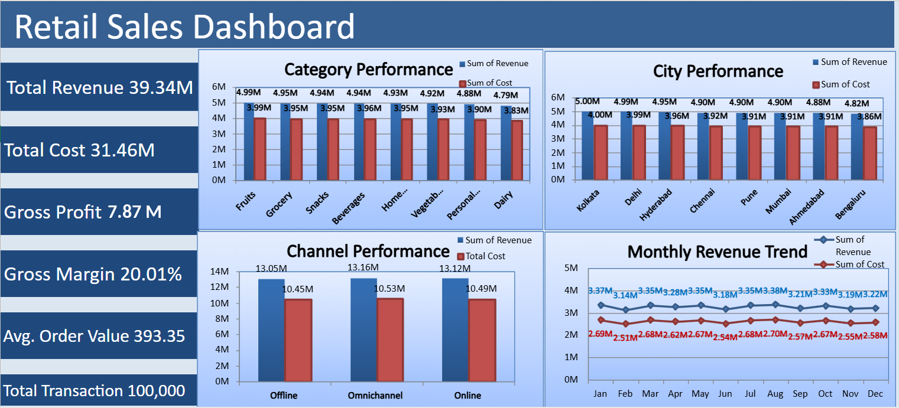

# Retail Sales Analysis

End-to-end data cleaning and analysis project on a 100,000-record retail sales dataset, using SQL for cleaning/validation and Excel for pivot analysis and dashboarding.

## Project Overview

This project simulates a real-world retail analytics workflow: take raw transactional data, clean and validate it with SQL, then build an interactive Excel dashboard for business reporting.

**Dataset:** 100,000 retail transactions across 8 Indian cities, 3 store formats, 8 product categories, and 9 brands.

## Tools Used

- **SQLite / DB Browser for SQLite** — data cleaning, validation, QA checks
- **Microsoft Excel** — PivotTables, PivotCharts, KPI dashboard

## Workflow

### 1. SQL: Cleaning & Validation (`retail_sales_analysis.sql`)

- Inspected table structure and column types
- Checked for duplicate `Invoice_ID`s (found 62 — confirmed these are coincidental ID collisions on otherwise distinct transactions, not true duplicate records)
- Quantified missing values in `Customer_Age` and `Customer_Gender`
- Reviewed distinct values across all categorical fields (City, Store_Format, Category, Brand, Channel, Payment_Mode, Customer_Gender, Loyalty_Flag) to catch inconsistent entries
- Checked for leading/trailing whitespace in text fields
- Validated that `Revenue`, `Cost`, and `Margin` correctly match their underlying formulas (`Units × Price`, `Revenue − Cost`)
- Built a cleaned table (`retail_sales_clean`) that:
  - Casts `Customer_Age` to integer
  - Standardizes `Customer_Gender` to `M`/`F`, converting unknown/invalid values to `NULL`
- Validated row counts and non-null counts on the cleaned table
- Calculated baseline business KPIs (total revenue, cost, margin, average revenue) as a handoff point into Excel

### 2. Excel: Analysis & Dashboard (`Retail_Sales_Analysis.xlsx`)

- **Retail_Sales_Raw_Data** — original dataset
- **Retail_Sales_Analysis** — cleaned data with derived `Invoice_Month` field, gender labels expanded to Male/Female for readability
- **Pivot** — PivotTables summarizing performance by Category, City, Channel, Month, Brand, Payment Method, Store Format, and Loyalty status
- **DashBoard** — summary KPI cards (Total Revenue, Total Cost, Gross Profit, Gross Margin %, Avg. Order Value, Total Transactions) with linked PivotCharts:
  - Category Performance
  - Channel Performance
  - City Performance
  - Monthly Revenue Trend

## Dashboard

## Key Metrics

| Metric | Value |
|---|---|
| Total Revenue | ₹39.34M |
| Total Cost | ₹31.46M |
| Gross Profit | ₹7.87M |
| Gross Margin | 20.01% |
| Avg. Order Value | ₹393.35 |
| Total Transactions | 100,000 |

## Notes / Known Limitations

- `Invoice_ID` is not a guaranteed unique key — some IDs repeat by coincidence across otherwise unrelated transactions.
- `Customer_Age` and `Customer_Gender` have missing values (unknowns), left as `NULL` rather than imputed.

## Project Files

| File | Description |
|---|---|
| `Retail_Sales_Analysis.xlsx` | Complete Excel analysis, PivotTables, and dashboard |
| `retail_sales_analysis.sql` | SQL cleaning, validation, and KPI queries |
| `dashboard.png` | Screenshot of the completed Excel dashboard |

## Purpose

This project was built as a data analysis portfolio piece to demonstrate SQL data cleaning and validation, Excel PivotTable/PivotChart analysis, and dashboard design for business reporting.
